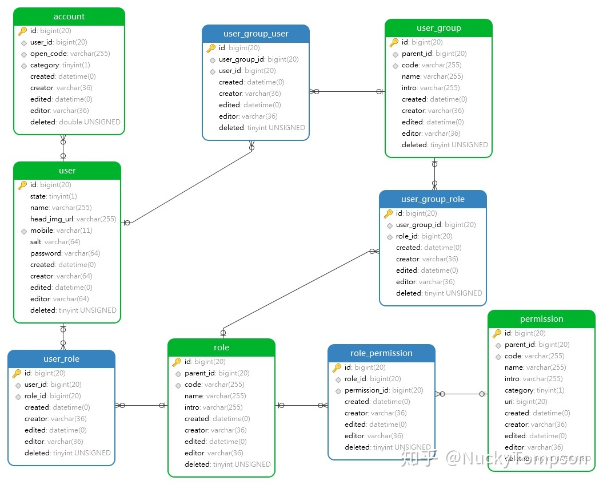

# 1. MariaDB
Refer:  
https://hub.docker.com/\_/mariadb  
https://zhuanlan.zhihu.com/p/97035035  
## 1.1. docker
```
docker pull mariadb
docker network create hfcms-mariadb
docker run --detach \
--publish 3306:3306 \
--env MARIADB_ROOT_PASSWORD=my-secret-pw \
--network hfcms-mariadb \
--name hfcms-mariadb \
mariadb:latest

docker exec -it hfcms-mariadb mysql -u root -pmy-secret-pw
```
MARIADB\_ROOT\_PASSWORD=`my-secret-pw`

## 1.2 mariadb

1. Change root password:
```
mysql> ALTER USER 'root'@'localhost' IDENTIFIED BY '[newpassword]';
```
2. Creating database dumps
```
$ docker exec hfcms-mariadb sh -c 'exec mysqldump -uroot -p"$MARIADB_ROOT_PASSWORD" hfcms_users' > ./hfcms_users.sql
```
3. Restoring data from dump files
```
$ docker exec -i hfcms-mariadb sh -c 'exec mysql -uroot -p"$MARIADB_ROOT_PASSWORD" hfcms_users' < ./hfcms_users.sql
```
4. Create tables:  

Database
```
DROP database hfcms_users;
CREATE database hfcms_users;
CREATE USER 'hfcms_users_user'@'%' IDENTIFIED BY 'hfcms_users_user_passwd';
GRANT ALL PRIVILEGES ON hfcms_users.* TO 'hfcms_users_user'@'%';
FLUSH PRIVILEGES;
USE hfcms_users;
```
Users
```
CREATE TABLE IF NOT EXISTS users (
  id int(10) NOT NULL AUTO_INCREMENT,
  username VARCHAR(255),
  password VARCHAR(255),
  realname VARCHAR(255),
  nickname VARCHAR(255),
  avatar_url VARCHAR(255),
  phone VARCHAR(11),
  user_ip INT(4) UNSIGNED,
  state TINYINT(1) COMMENT 'user state: 0=normal, 1=disable',
  deleted TINYINT(1) DEFAULT 0 COMMENT 'soft deleted: 0=undelete,1=deleted',
  create_time TIMESTAMP DEFAULT CURRENT_TIMESTAMP,
  update_time TIMESTAMP DEFAULT CURRENT_TIMESTAMP ON UPDATE CURRENT_TIMESTAMP,
  PRIMARY KEY (id)
);
``` 
Departments
```
CREATE TABLE IF NOT EXISTS departments (
  id int(10) NOT NULL AUTO_INCREMENT,
  parent_id INT(10) UNIQUE,
  code VARCHAR(255) UNIQUE,
  name VARCHAR(255),
  description VARCHAR(255),
  state TINYINT(1) COMMENT 'user state: 0=normal, 1=disable',
  deleted TINYINT(1) DEFAULT 0 COMMENT 'soft deleted: 0=undelete,1=deleted',
  update_time TIMESTAMP DEFAULT CURRENT_TIMESTAMP ON UPDATE CURRENT_TIMESTAMP,
  PRIMARY KEY (id)
);
```
Department Users 
```
CREATE TABLE IF NOT EXISTS department_users (
  id int(10) NOT NULL AUTO_INCREMENT,
  department_id INT(10),
  user_id INT(10),
  state TINYINT(1) COMMENT 'user state: 0=normal, 1=disable',
  deleted TINYINT(1) DEFAULT 0 COMMENT 'soft deleted: 0=undelete,1=deleted',
  update_time TIMESTAMP DEFAULT CURRENT_TIMESTAMP ON UPDATE CURRENT_TIMESTAMP,
  PRIMARY KEY (id)
);
```
Roles
```
CREATE TABLE IF NOT EXISTS roles (
  id int(10) NOT NULL AUTO_INCREMENT,
  parent_id INT(10) UNIQUE,
  code VARCHAR(255) UNIQUE,
  name VARCHAR(255),
  description VARCHAR(255),
  state TINYINT(1) COMMENT 'user state: 0=normal, 1=disable',
  deleted TINYINT(1) DEFAULT 0 COMMENT 'soft deleted: 0=undelete,1=deleted',
  update_time TIMESTAMP DEFAULT CURRENT_TIMESTAMP ON UPDATE CURRENT_TIMESTAMP,
  PRIMARY KEY (id)
);
```
Role Users 
```
CREATE TABLE IF NOT EXISTS role_users (
  id int(10) NOT NULL AUTO_INCREMENT,
  role_id INT(10),
  user_id INT(10),
  state TINYINT(1) COMMENT 'user state: 0=normal, 1=disable',
  deleted TINYINT(1) DEFAULT 0 COMMENT 'soft deleted: 0=undelete,1=deleted',
  update_time TIMESTAMP DEFAULT CURRENT_TIMESTAMP ON UPDATE CURRENT_TIMESTAMP,
  PRIMARY KEY (id)
);
```
Permissions
```
CREATE TABLE IF NOT EXISTS permissions (
  id int(10) NOT NULL AUTO_INCREMENT,
  parent_id INT(10) UNIQUE,
  code VARCHAR(255) UNIQUE,
  name VARCHAR(255),
  description VARCHAR(255),
  state TINYINT(1) COMMENT 'user state: 0=normal, 1=disable',
  deleted TINYINT(1) DEFAULT 0 COMMENT 'soft deleted: 0=undelete,1=deleted',
  update_time TIMESTAMP DEFAULT CURRENT_TIMESTAMP ON UPDATE CURRENT_TIMESTAMP,
  UNIQUE KEY (id)
);
```
Role Permissions
```
CREATE TABLE IF NOT EXISTS role_permissions (
  id int(10) NOT NULL AUTO_INCREMENT,
  role_id INT(10),
  permission_id INT(10),
  state TINYINT(1) COMMENT 'user state: 0=normal, 1=disable',
  deleted TINYINT(1) DEFAULT 0 COMMENT 'soft deleted: 0=undelete,1=deleted',
  update_time TIMESTAMP DEFAULT CURRENT_TIMESTAMP ON UPDATE CURRENT_TIMESTAMP,
  PRIMARY KEY (id)
);
```
Usergroups
```
CREATE TABLE IF NOT EXISTS usergroups (
  id int(10) NOT NULL AUTO_INCREMENT,
  parent_id INT(10) UNIQUE,
  code VARCHAR(255) UNIQUE,
  name VARCHAR(255),
  description VARCHAR(255),
  state TINYINT(1) COMMENT 'user state: 0=normal, 1=disable',
  deleted TINYINT(1) DEFAULT 0 COMMENT 'soft deleted: 0=undelete,1=deleted',
  update_time TIMESTAMP DEFAULT CURRENT_TIMESTAMP ON UPDATE CURRENT_TIMESTAMP,
  PRIMARY KEY (id)
);
```
Usergroup Users
```
CREATE TABLE IF NOT EXISTS usergroup_users (
  id int(10) NOT NULL AUTO_INCREMENT,
  usergroup_id INT(10),
  user_id INT(10),
  state TINYINT(1) COMMENT 'user state: 0=normal, 1=disable',
  deleted TINYINT(1) DEFAULT 0 COMMENT 'soft deleted: 0=undelete,1=deleted',
  update_time TIMESTAMP DEFAULT CURRENT_TIMESTAMP ON UPDATE CURRENT_TIMESTAMP,
  PRIMARY KEY (id)
);
```
Role Usergroups
```
CREATE TABLE IF NOT EXISTS role_usergroups (
  id int(10) NOT NULL AUTO_INCREMENT,
  role_id INT(10),
  usergroup_id INT(10),
  state TINYINT(1) COMMENT 'user state: 0=normal, 1=disable',
  deleted TINYINT(1) DEFAULT 0 COMMENT 'soft deleted: 0=undelete,1=deleted',
  update_time TIMESTAMP DEFAULT CURRENT_TIMESTAMP ON UPDATE CURRENT_TIMESTAMP,
  PRIMARY KEY (id)
);
```

SQL All in one
```
DROP database hfcms_users;
CREATE database hfcms_users DEFAULT CHARSET utf8 COLLATE utf8_general_ci;
CREATE USER 'hfcms_users_user'@'%' IDENTIFIED BY 'hfcms_users_user_passwd';
GRANT ALL PRIVILEGES ON hfcms_users.* TO 'hfcms_users_user'@'%';
FLUSH PRIVILEGES;
USE hfcms_users;
CREATE TABLE IF NOT EXISTS users (
  id int(10) NOT NULL AUTO_INCREMENT,
  username VARCHAR(255),
  password VARCHAR(255),
  realname VARCHAR(255),
  nickname VARCHAR(255),
  avatar_url VARCHAR(255),
  phone VARCHAR(11),
  user_ip INT(4) UNSIGNED,
  state TINYINT(1) DEFAULT 0 COMMENT 'user state: 0=normal, 1=disable',
  deleted TINYINT(1) DEFAULT 0 COMMENT 'soft deleted: 0=undelete,1=deleted',
  create_time TIMESTAMP DEFAULT CURRENT_TIMESTAMP,
  update_time TIMESTAMP DEFAULT CURRENT_TIMESTAMP ON UPDATE CURRENT_TIMESTAMP,
  UNIQUE KEY (id)
);
CREATE TABLE IF NOT EXISTS departments (
  id int(10) NOT NULL AUTO_INCREMENT,
  parent_id INT(10) DEFAULT NULL,
  code VARCHAR(255) UNIQUE,
  name VARCHAR(255),
  description VARCHAR(255),
  state TINYINT(1) DEFAULT 0 COMMENT 'user state: 0=normal, 1=disable',
  deleted TINYINT(1) DEFAULT 0 COMMENT 'soft deleted: 0=undelete,1=deleted',
  update_time TIMESTAMP DEFAULT CURRENT_TIMESTAMP ON UPDATE CURRENT_TIMESTAMP,
  PRIMARY KEY (id)
);
CREATE TABLE IF NOT EXISTS department_users (
  id int(10) NOT NULL AUTO_INCREMENT,
  department_id INT(10),
  user_id INT(10),
  state TINYINT(1) COMMENT 'user state: 0=normal, 1=disable',
  deleted TINYINT(1) DEFAULT 0 COMMENT 'soft deleted: 0=undelete,1=deleted',
  update_time TIMESTAMP DEFAULT CURRENT_TIMESTAMP ON UPDATE CURRENT_TIMESTAMP,
  PRIMARY KEY (id)
);
CREATE TABLE IF NOT EXISTS roles (
  id int(10) NOT NULL AUTO_INCREMENT,
  parent_id INT(10) DEFAULT NULL,
  code VARCHAR(255) UNIQUE,
  name VARCHAR(255),
  description VARCHAR(255),
  state TINYINT(1) COMMENT 'user state: 0=normal, 1=disable',
  deleted TINYINT(1) DEFAULT 0 COMMENT 'soft deleted: 0=undelete,1=deleted',
  update_time TIMESTAMP DEFAULT CURRENT_TIMESTAMP ON UPDATE CURRENT_TIMESTAMP,
  PRIMARY KEY (id)
);
CREATE TABLE IF NOT EXISTS role_users (
  id int(10) NOT NULL AUTO_INCREMENT,
  role_id INT(10),
  user_id INT(10),
  state TINYINT(1) COMMENT 'user state: 0=normal, 1=disable',
  deleted TINYINT(1) DEFAULT 0 COMMENT 'soft deleted: 0=undelete,1=deleted',
  update_time TIMESTAMP DEFAULT CURRENT_TIMESTAMP ON UPDATE CURRENT_TIMESTAMP,
  PRIMARY KEY (id)
);
CREATE TABLE IF NOT EXISTS permissions (
  id int(10) NOT NULL AUTO_INCREMENT,
  parent_id INT(10) DEFAULT NULL,
  code VARCHAR(255) UNIQUE,
  name VARCHAR(255),
  description VARCHAR(255),
  state TINYINT(1) COMMENT 'user state: 0=normal, 1=disable',
  deleted TINYINT(1) DEFAULT 0 COMMENT 'soft deleted: 0=undelete,1=deleted',
  update_time TIMESTAMP DEFAULT CURRENT_TIMESTAMP ON UPDATE CURRENT_TIMESTAMP,
  UNIQUE KEY (id)
);
CREATE TABLE IF NOT EXISTS role_permissions (
  id int(10) NOT NULL AUTO_INCREMENT,
  role_id INT(10),
  permission_id INT(10),
  state TINYINT(1) COMMENT 'user state: 0=normal, 1=disable',
  deleted TINYINT(1) DEFAULT 0 COMMENT 'soft deleted: 0=undelete,1=deleted',
  update_time TIMESTAMP DEFAULT CURRENT_TIMESTAMP ON UPDATE CURRENT_TIMESTAMP,
  PRIMARY KEY (id)
);
CREATE TABLE IF NOT EXISTS usergroups (
  id int(10) NOT NULL AUTO_INCREMENT,
  parent_id INT(10) DEFAULT NULL,
  code VARCHAR(255) UNIQUE,
  name VARCHAR(255),
  description VARCHAR(255),
  state TINYINT(1) COMMENT 'user state: 0=normal, 1=disable',
  deleted TINYINT(1) DEFAULT 0 COMMENT 'soft deleted: 0=undelete,1=deleted',
  update_time TIMESTAMP DEFAULT CURRENT_TIMESTAMP ON UPDATE CURRENT_TIMESTAMP,
  PRIMARY KEY (id)
);
CREATE TABLE IF NOT EXISTS usergroup_users (
  id int(10) NOT NULL AUTO_INCREMENT,
  usergroup_id INT(10),
  user_id INT(10),
  state TINYINT(1) COMMENT 'user state: 0=normal, 1=disable',
  deleted TINYINT(1) DEFAULT 0 COMMENT 'soft deleted: 0=undelete,1=deleted',
  update_time TIMESTAMP DEFAULT CURRENT_TIMESTAMP ON UPDATE CURRENT_TIMESTAMP,
  PRIMARY KEY (id)
);
CREATE TABLE IF NOT EXISTS role_usergroups (
  id int(10) NOT NULL AUTO_INCREMENT,
  role_id INT(10),
  usergroup_id INT(10),
  state TINYINT(1) COMMENT 'user state: 0=normal, 1=disable',
  deleted TINYINT(1) DEFAULT 0 COMMENT 'soft deleted: 0=undelete,1=deleted',
  update_time TIMESTAMP DEFAULT CURRENT_TIMESTAMP ON UPDATE CURRENT_TIMESTAMP,
  PRIMARY KEY (id)
);
```
Insert
```
INSERT INTO users(username, password, realname, nickname, avatar_url, phone, user_ip)
VALUES
  ('zhangsan', (SELECT PASSWORD('zhangsanpwd')), 'zhangsan', 'zhangsansan', 'zhangsan.jpg', '13912345678', INET_ATON('192.168.0.10')),
  ('lisi', (SELECT PASSWORD('lisipwd')), 'lisi', 'lisisi', 'lisi.jpg', '13912345679', INET_ATON('192.168.0.11')),
  ('wangwu', (SELECT PASSWORD('wangwupwd')), 'wangwu', 'wangwuwu', 'wangwu.jpg', '13912345670', INET_ATON('192.168.0.12')),
  ('test', (SELECT PASSWORD('testpwd')), 'test', 'testt', 'test.jpg', '13912345671', INET_ATON('192.168.1.13')),
  ('guest', (SELECT PASSWORD('guestpwd')), 'guest', 'guestt', 'guest.jpg', '13912345611', INET_ATON('192.168.1.14'));
INSERT INTO departments(parent_id, code, name, description)
VALUES
  (NULL, 'dbcd', 'SDP', 'Sales Department'),
  (NULL, 'dfgh', 'PRD', 'Public Relations Department'),
  (NULL, 'djkl', 'R&D', 'Research and Development Department'),
  (NULL, 'dnop', 'FD', 'Finance Department'),
  (NULL, 'drst', 'F&B', 'Food & Beverage Department'),
  (1, 'duvw', 'SDO', 'Sales Department Office');
INSERT INTO department_users(department_id, user_id)
VALUES
  (4, 3),
  (5, 4),
  (5, 2),
  (5, 1);
INSERT INTO roles(parent_id, code, name, description)
VALUES
  (NULL, 'rabc', 'master', 'You know, here\'s my spot.'),
  (NULL, 'rdef', 'submaster', 'You know, master is my boss.'),
  (NULL, 'rdeg', 'users', 'Ordinary people'),
  (NULL, 'rdeh', 'guest', 'May be newbie here'),
  (NULL, 'rghi', 'blocked', 'clear out here!');
INSERT INTO role_users(role_id, user_id)
VALUES
  (1, 1),
  (2, 2),
  (2, 3),
  (3, 4);
INSERT INTO permissions(parent_id, code, name, description)
VALUES
  (NULL, 'pabc', 'delete', 'oh no!'),
  (NULL, 'pdef', 'update', 'be carefull'),
  (NULL, 'pghi', 'create', 'Create what?'),
  (NULL, 'pjkl', 'query', 'ok, show you'),
  (2, 'pmon', 'article', 'update article');
INSERT INTO role_permissions(role_id, permission_id)
VALUES
  (1, 1),
  (1, 2),
  (1, 3),
  (1, 4),
  (1, 5),
  (2, 3),
  (2, 4),
  (3, 4);
INSERT INTO usergroups(parent_id, code, name, description)
VALUES
  (NULL, 'ug001', 'GameMaster', 'My plasure'),
  (NULL, 'ug100', 'Room Master', 'All rooms control'),
  (2, 'ug101', 'Room 1', 'good day'),
  (2, 'ug102', 'Room 2', 'good day'),
  (2, 'ug103', 'Room 3', 'good day');
INSERT INTO usergroup_users(usergroup_id, user_id)
VALUES
  (1, 1),
  (2, 2),
  (3, 3),
  (4, 3),
  (5, 3);
INSERT INTO role_usergroups(role_id, usergroup_id)
VALUES
  (1, 1),
  (2, 2),
  (3, 3),
  (3, 4),
  (3, 5);
```
Validate
```
select host,
       user as username,
       password,
       password_expired
from mysql.user
order by user;
SHOW GRANTS FOR hfcms_users_user;
describe users;
describe roles;
desc role_users;
desc permissions;
desc role_permissions;
desc usergroups;
desc usergroup_users;
desc role_usergroups;
```
Output:
```
MariaDB [hfcms_users]> select host,
    ->        user as username,
    ->        password,
    ->        password_expired
    -> from mysql.user
    -> order by user;
+-----------+---------------------+-------------------------------------------+------------------+
| Host      | username            | Password                                  | password_expired |
+-----------+---------------------+-------------------------------------------+------------------+
| %         | hfcms_articles_user | *7B5855D2183D391D34685174C1A975CD23979B17 | N                |
| %         | hfcms_users_user    | *CBF9C118375B4DBFCE57493A331215C4F059F702 | N                |
| localhost | mariadb.sys         |                                           | Y                |
| localhost | root                | *27C01464AD101AED1E65AC21152499A396B4CF72 | N                |
| %         | root                | *27C01464AD101AED1E65AC21152499A396B4CF72 | N                |
+-----------+---------------------+-------------------------------------------+------------------+
5 rows in set (0.001 sec)

MariaDB [hfcms_users]> SHOW GRANTS FOR hfcms_users_user;
+-----------------------------------------------------------------------------------------------------------------+
| Grants for hfcms_users_user@%                                                                                   |
+-----------------------------------------------------------------------------------------------------------------+
| GRANT USAGE ON *.* TO `hfcms_users_user`@`%` IDENTIFIED BY PASSWORD '*CBF9C118375B4DBFCE57493A331215C4F059F702' |
| GRANT ALL PRIVILEGES ON `hfcms_users`.* TO `hfcms_users_user`@`%`                                               |
+-----------------------------------------------------------------------------------------------------------------+
2 rows in set (0.000 sec)

MariaDB [hfcms_users]> describe users;
+-------------+-----------------+------+-----+---------------------+-------------------------------+
| Field       | Type            | Null | Key | Default             | Extra                         |
+-------------+-----------------+------+-----+---------------------+-------------------------------+
| id          | int(10)         | NO   | PRI | NULL                | auto_increment                |
| username    | varchar(255)    | YES  |     | NULL                |                               |
| password    | varchar(255)    | YES  |     | NULL                |                               |
| realname    | varchar(255)    | YES  |     | NULL                |                               |
| nickname    | varchar(255)    | YES  |     | NULL                |                               |
| avatar_url  | varchar(255)    | YES  |     | NULL                |                               |
| phone       | varchar(11)     | YES  |     | NULL                |                               |
| user_ip     | int(4) unsigned | YES  |     | NULL                |                               |
| state       | tinyint(1)      | YES  |     | NULL                |                               |
| deleted     | tinyint(1)      | YES  |     | 0                   |                               |
| create_time | timestamp       | NO   |     | current_timestamp() |                               |
| update_time | timestamp       | NO   |     | current_timestamp() | on update current_timestamp() |
+-------------+-----------------+------+-----+---------------------+-------------------------------+
12 rows in set (0.001 sec)

MariaDB [hfcms_users]> describe roles;
+-------------+--------------+------+-----+---------------------+-------------------------------+
| Field       | Type         | Null | Key | Default             | Extra                         |
+-------------+--------------+------+-----+---------------------+-------------------------------+
| id          | int(10)      | NO   | PRI | NULL                | auto_increment                |
| parent_id   | int(10)      | YES  | UNI | NULL                |                               |
| code        | varchar(255) | YES  | UNI | NULL                |                               |
| name        | varchar(255) | YES  |     | NULL                |                               |
| description | varchar(255) | YES  |     | NULL                |                               |
| state       | tinyint(1)   | YES  |     | NULL                |                               |
| deleted     | tinyint(1)   | YES  |     | 0                   |                               |
| update_time | timestamp    | NO   |     | current_timestamp() | on update current_timestamp() |
+-------------+--------------+------+-----+---------------------+-------------------------------+
8 rows in set (0.001 sec)

MariaDB [hfcms_users]> desc role_users;
+-------------+------------+------+-----+---------------------+-------------------------------+
| Field       | Type       | Null | Key | Default             | Extra                         |
+-------------+------------+------+-----+---------------------+-------------------------------+
| id          | int(10)    | NO   | PRI | NULL                | auto_increment                |
| role_id     | int(10)    | YES  |     | NULL                |                               |
| user_id     | int(10)    | YES  |     | NULL                |                               |
| state       | tinyint(1) | YES  |     | NULL                |                               |
| deleted     | tinyint(1) | YES  |     | 0                   |                               |
| update_time | timestamp  | NO   |     | current_timestamp() | on update current_timestamp() |
+-------------+------------+------+-----+---------------------+-------------------------------+
6 rows in set (0.001 sec)

MariaDB [hfcms_users]> desc permissions;
+-------------+--------------+------+-----+---------------------+-------------------------------+
| Field       | Type         | Null | Key | Default             | Extra                         |
+-------------+--------------+------+-----+---------------------+-------------------------------+
| id          | int(10)      | NO   | PRI | NULL                | auto_increment                |
| parent_id   | int(10)      | YES  | UNI | NULL                |                               |
| code        | varchar(255) | YES  | UNI | NULL                |                               |
| name        | varchar(255) | YES  |     | NULL                |                               |
| description | varchar(255) | YES  |     | NULL                |                               |
| state       | tinyint(1)   | YES  |     | NULL                |                               |
| deleted     | tinyint(1)   | YES  |     | 0                   |                               |
| update_time | timestamp    | NO   |     | current_timestamp() | on update current_timestamp() |
+-------------+--------------+------+-----+---------------------+-------------------------------+
8 rows in set (0.001 sec)

MariaDB [hfcms_users]> desc role_permissions;
+---------------+------------+------+-----+---------------------+-------------------------------+
| Field         | Type       | Null | Key | Default             | Extra                         |
+---------------+------------+------+-----+---------------------+-------------------------------+
| id            | int(10)    | NO   | PRI | NULL                | auto_increment                |
| role_id       | int(10)    | YES  |     | NULL                |                               |
| permission_id | int(10)    | YES  |     | NULL                |                               |
| state         | tinyint(1) | YES  |     | NULL                |                               |
| deleted       | tinyint(1) | YES  |     | 0                   |                               |
| update_time   | timestamp  | NO   |     | current_timestamp() | on update current_timestamp() |
+---------------+------------+------+-----+---------------------+-------------------------------+
6 rows in set (0.001 sec)

MariaDB [hfcms_users]> desc usergroups;
+-------------+--------------+------+-----+---------------------+-------------------------------+
| Field       | Type         | Null | Key | Default             | Extra                         |
+-------------+--------------+------+-----+---------------------+-------------------------------+
| id          | int(10)      | NO   | PRI | NULL                | auto_increment                |
| parent_id   | int(10)      | YES  | UNI | NULL                |                               |
| code        | varchar(255) | YES  | UNI | NULL                |                               |
| name        | varchar(255) | YES  |     | NULL                |                               |
| description | varchar(255) | YES  |     | NULL                |                               |
| state       | tinyint(1)   | YES  |     | NULL                |                               |
| deleted     | tinyint(1)   | YES  |     | 0                   |                               |
| update_time | timestamp    | NO   |     | current_timestamp() | on update current_timestamp() |
+-------------+--------------+------+-----+---------------------+-------------------------------+
8 rows in set (0.001 sec)

MariaDB [hfcms_users]> desc usergroup_users;
+--------------+------------+------+-----+---------------------+-------------------------------+
| Field        | Type       | Null | Key | Default             | Extra                         |
+--------------+------------+------+-----+---------------------+-------------------------------+
| id           | int(10)    | NO   | PRI | NULL                | auto_increment                |
| usergroup_id | int(10)    | YES  |     | NULL                |                               |
| user_id      | int(10)    | YES  |     | NULL                |                               |
| state        | tinyint(1) | YES  |     | NULL                |                               |
| deleted      | tinyint(1) | YES  |     | 0                   |                               |
| update_time  | timestamp  | NO   |     | current_timestamp() | on update current_timestamp() |
+--------------+------------+------+-----+---------------------+-------------------------------+
6 rows in set (0.001 sec)

MariaDB [hfcms_users]> desc role_usergroups;
+--------------+------------+------+-----+---------------------+-------------------------------+
| Field        | Type       | Null | Key | Default             | Extra                         |
+--------------+------------+------+-----+---------------------+-------------------------------+
| id           | int(10)    | NO   | PRI | NULL                | auto_increment                |
| role_id      | int(10)    | YES  |     | NULL                |                               |
| usergroup_id | int(10)    | YES  |     | NULL                |                               |
| state        | tinyint(1) | YES  |     | NULL                |                               |
| deleted      | tinyint(1) | YES  |     | 0                   |                               |
| update_time  | timestamp  | NO   |     | current_timestamp() | on update current_timestamp() |
+--------------+------------+------+-----+---------------------+-------------------------------+
6 rows in set (0.001 sec)
```
